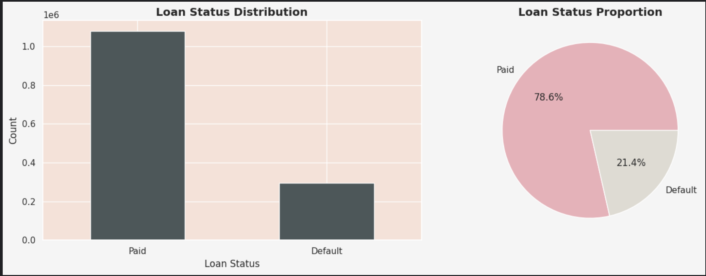
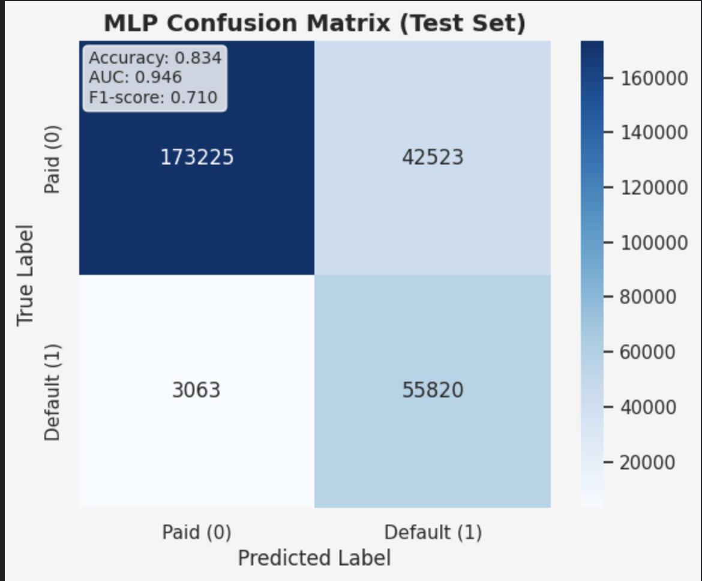
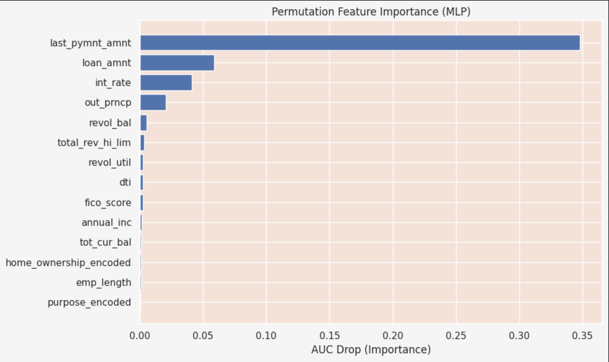
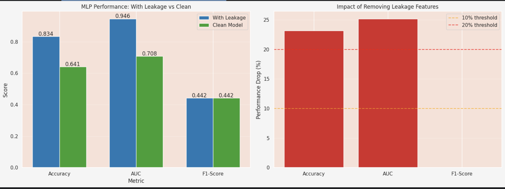

# 🧠 Loan Default Prediction — Lending Club Dataset (2007–2018)

> Predicting whether a loan applicant will default or fully repay using advanced deep learning models.

---

## 📘 Overview

This project aims to **predict loan default risk** using the **Lending Club dataset (2007–2018)**.  
It demonstrates a **complete ML pipeline** — from data preprocessing, leakage detection, and feature engineering to model training, evaluation, and interpretability.

The project compares a **leakage-prone model** and a **clean (realistic) model**, highlighting how data leakage can falsely inflate performance.

---

## 📂 Dataset

**Source:** [Lending Club Loan Data (2007–2018)](https://www.kaggle.com/datasets/wordsforthewise/lending-club)  
**Size:** ~2.2 million rows, 150+ features  
**Target Variable:** `loan_status`

### Target Mapping
| Loan Status | Encoded Value |
|--------------|---------------|
| Fully Paid | 0 |
| Charged Off / Default / Late | 1 |

---

## 🧹 Data Preparation

Steps performed:
1. Loaded dataset from the `.csv.gz` file.  
2. Filtered only **completed loans** (`Fully Paid`, `Charged Off`, `Default`, etc.).  
3. Mapped loan statuses to binary outcomes (0 = repaid, 1 = defaulted).  
4. Handled missing values, categorical encoding, and scaling using `StandardScaler`.  
5. Optionally sampled 100,000 rows for faster experimentation (configurable).  

> 📝 To train on full dataset, simply comment out the sampling section.

---
### 🔍 Key Observations from EDA

- **Class Imbalance Detected:** ~78.6% *Paid* vs ~21.4% *Default*  
- **Interest Rate:** Shows a clear separation between *Paid* and *Defaulted* loans  
- **Outstanding Principal** and **FICO Score:** Differ significantly by loan status  
- **Feature Correlations:** Some numerical features exhibit moderate correlation  
- ⚠️ **Note:** This imbalance reflects real-world lending data, but it requires careful handling during model training and evaluation (e.g., using AUC, F1-score, or
 
### 🎯 Feature Selection Justification

The following set of **desired features** has been carefully curated to balance predictive power and real-world interpretability.  
They represent variables that are **either known at loan application time** or are **key indicators of borrower creditworthiness**.

---

#### 🧮 **Numeric Features**

| Feature | Description | Justification |
|----------|--------------|----------------|
| **loan_amnt** | Loan amount requested | Captures the size of credit exposure — higher loans imply higher potential risk and return. |
| **int_rate** | Interest rate | Reflects the lender’s assessment of borrower risk; correlated with creditworthiness. |
| **instalment** | Monthly payment | Represents repayment burden; helps assess affordability relative to income. |
| **annual_inc** | Annual income | Measures borrower’s repayment capacity and financial stability. |
| **dti** | Debt-to-income ratio | A core credit risk indicator; higher DTI implies higher default probability. |
| **fico_score** | FICO credit score | Industry-standard measure of credit reliability; strong predictor of default. |
| **revol_bal** | Revolving balance | Reflects existing credit usage; higher balances imply potential over-leverage. |
| **revol_util** | Revolving utilisation % | Indicates how much of available credit the borrower is using — a classic credit risk metric. |
| **out_prncp** | Outstanding principal | Shows remaining balance; useful for ongoing performance but **may cause leakage** if used at approval time. |
| **last_pymnt_amnt** | Last payment amount | Indicates borrower behavior but is **a post-outcome variable** — potential leakage feature. |
| **tot_cur_bal** | Total current balance | Summarizes overall exposure across loans — indicates existing financial load. |
| **total_rev_hi_lim** | Total revolving limit | Represents credit capacity; higher limits suggest stronger financial profiles. |
| **emp_length** | Employment length (years) | Stability of employment is directly linked to repayment reliability. |

---

#### 🏠 **Categorical Features**

| Feature | Description | Justification |
|----------|--------------|----------------|
| **home_ownership** | Home ownership status | Reflects asset stability and ability to leverage property as collateral. |
| **purpose** | Loan purpose | Provides context — e.g., debt consolidation, small business, etc., influencing repayment likelihood. |

---

#### ⚠️ **Leakage Awareness**

- Features like `out_prncp` and `last_pymnt_amnt` are **post-loan performance indicators**, not available at approval time.  
- These are included **only for analysis** — later steps will detect and remove such variables to prevent **data leakage**.

---

✅ **Summary:**
This combination of features provides a comprehensive view of **borrower capacity**, **credit history**, and **loan structure**, while maintaining interpretability and relevance for both **traditional risk modeling** and **modern machine learning approaches**.

## ⚙️ Model Training

### 2️⃣ MLP (Neural Network)
- Built in **PyTorch**.
- Scaled features used.
- Mini-batch training with dropout regularization.

### Model architecture (MLP)
| Layer | Units | Activation |
|--------|--------|-------------|
| Input | N (features) | — |
| Hidden 1 | 128 | ReLU |
| Hidden 2 | 64 | ReLU |
| Dropout | 0.3 | — |
| Output | 1 | Sigmoid |

---
### ⚠️ Key Insight: Feature Dominance & Data Leakage Detected

From the **Feature Importance Summary Plot** above, we observe:

- **`last_pymnt_amnt` (Last Payment Amount)** overwhelmingly dominates model predictions  
- This feature **overshadows** other important variables such as `int_rate`, `loan_amnt`, and `fico_score`  
- 🚨 **Critical Issue:** `last_pymnt_amnt` is a *post-outcome feature* — it reflects payments made **after** the loan decision, meaning it wouldn’t be available at approval time  
- This indicates **data leakage**, where the model inadvertently uses *future information* to predict *past outcomes*

💡 **Takeaway:**  
While the model achieved a seemingly excellent **94.6% AUC**, this performance is **misleading** — the model has learned repayment outcomes directly instead of genuine **credit risk patterns**.

## 🔍 Data Leakage Detection

A robust script scans all feature names for **leakage keywords** such as: ['pymnt', 'prncp', 'rec_', 'collection', 'recovery', 'last_', 'total_pymnt', 'out_prncp', 'next_pymnt']
These features contain **post-loan repayment information** and are **not available at application time**.

### Example output:
LEAKAGE: total_pymnt
LEAKAGE: last_pymnt_d
LEAKAGE: out_prncp_inv

> Removing them ensures that the model simulates real-world deployment.

---

## 📊 Evaluation Metrics

| Metric | Meaning | Why it matters |
|--------|----------|----------------|
| Accuracy | % of correct predictions | Basic measure |
| AUC-ROC | Area under ROC curve | Handles imbalance better |
| F1-Score | Harmonic mean of precision & recall | Good for imbalanced datasets |
| CV-AUC | Cross-validation score | Model stability check |

---

## 📉 Leakage Impact Analysis

| Metric | With Leakage | Clean Model | Drop | Drop % |
|--------|---------------|-------------|-------|--------|
| Accuracy | 0.834010 | 0.640893 | 0.193117 | 23.155275 |
| AUC | 0.946325 | 0.707915 | 0.238410 | 25.193297
| F1-Score 0.442278  |   0.442278  | 0.000000  | 0.000000

> 🚨 The AUC drop confirms **severe data leakage** in the original model.

---

## 📈 Visualizations

### 🧩 1. Loan status Distribution

---

### 🔻 2. MLP confusion matrix

> *Shows confusion matrix

---

### 🌟 3. Feature Importance (Clean Model)

> *Feature importance extracted Permutation Importance.*

---

### 💡 4. Comparision

---

## 🧠 Insights

- Data leakage can inflate metrics by **20–80%**, misleading model performance.
- Clean models generalize better to unseen data.
- AUC ≈ 0.70 (clean) reflects true predictive power.

---

